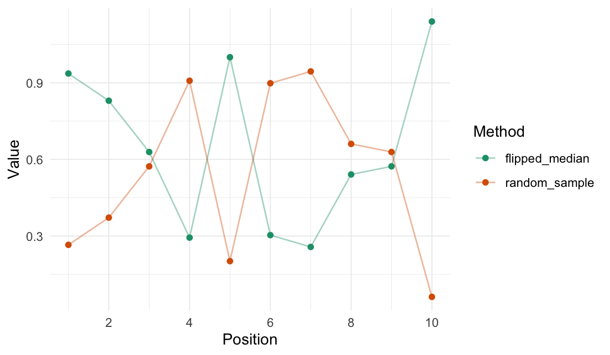
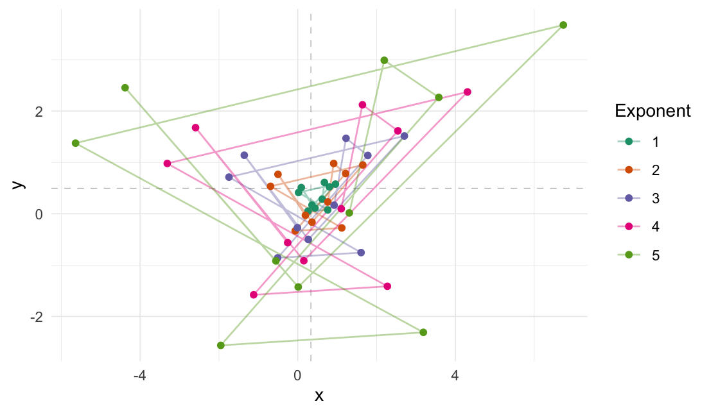
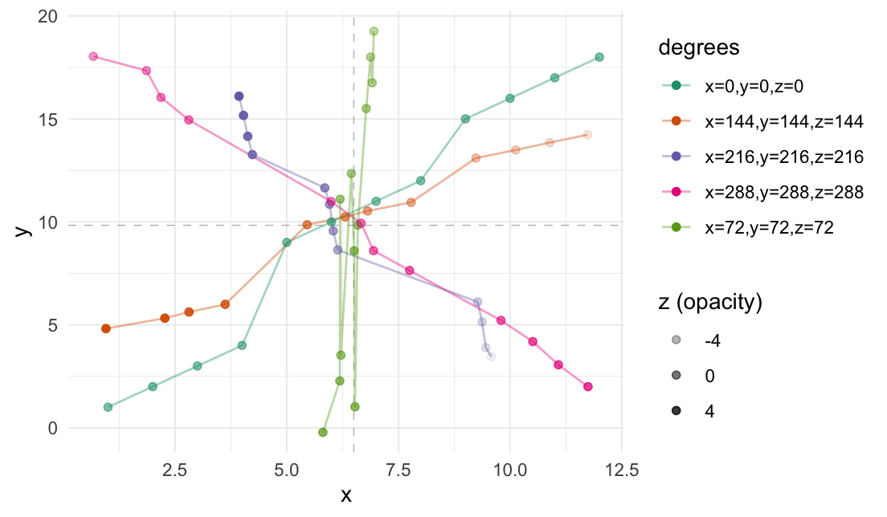
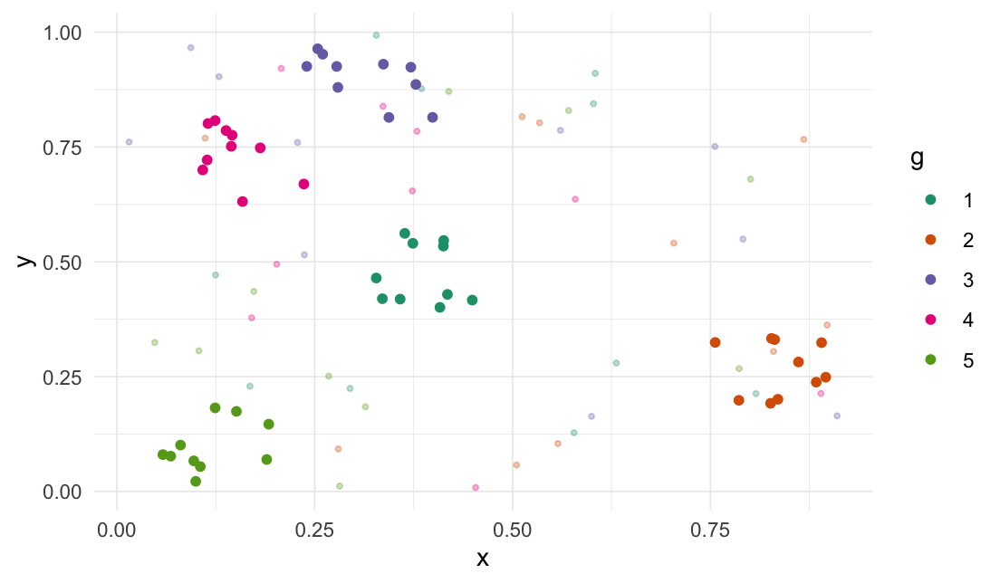

<!-- README.md is generated from README.Rmd. Please edit that file -->

<!-- # rearrr <a href='https://github.com/LudvigOlsen/rearrr'></a> -->

# rearrr

**Rearrrange Data**  
**Authors:** [Ludvig R. Olsen](http://ludvigolsen.dk/) (
<r-pkgs@ludvigolsen.dk> ) <br/> **License:**
[MIT](https://opensource.org/licenses/MIT) <br/> **Started:** April
2020

[](https://cran.r-project.org/package=rearrr)
[](https://cran.r-project.org/package=rearrr)
[](https://cran.r-project.org/)
[](https://codecov.io/gh/ludvigolsen/rearrr?branch=master)
[](https://travis-ci.org/LudvigOlsen/rearrr)
[](https://ci.appveyor.com/project/LudvigOlsen/rearrr)
<!-- [](https://zenodo.org/badge/latestdoi/71063931) -->

## Overview

R package for rearranging data by a set of methods.

We distinguish between **rearrangers** and **mutators**, where the first
*reorders* the data points and the second *changes the values* of the
data
points.

### Rearrangers

| Function          | Description                                                            |
| :---------------- | :--------------------------------------------------------------------- |
| `center_max()`    | Center the highest value with values decreasing around it.             |
| `center_min()`    | Center the lowest value with values increasing around it.              |
| `position_max()`  | Position the highest value with values decreasing around it.           |
| `position_min()`  | Position the lowest value with values increasing around it.            |
| `pair_extremes()` | Arrange values as highest, lowest, second highest, second lowest, etc. |
| `closest_to()`    | Order values by shortest distance to a target.                         |
| `furthest_from()` | Order values by longest distance to a target.                          |
| `rev_windows()`   | Reverse order window-wise.                                             |

### Mutators

| Function           | Description                                                        |
| :----------------- | :----------------------------------------------------------------- |
| `flip_values()`    | Flip the values around a center value.                             |
| `rotate2d()`       | Rotate values around an origin in 2 dimensions.                    |
| `expand_values()`  | Expand values around around an origin in any number of dimensions. |
| `cluster_groups()` | Move data points into clusters around group centroids.             |

### Helper functions

| Function               | Description                                                          |
| :--------------------- | :------------------------------------------------------------------- |
| `create_origin_fn()`   | Creates function for finding origin coordinates (like `centroid()`). |
| `centroid()`           | Calculates the mean of each supplied vector.                         |
| `transfer_centroids()` | Transfer centroids from one `data.frame` to another.                 |
| `min_max_scale()`      | Scale values to a range.                                             |

## Table of Contents

  - [rearrr](#rearrr)
      - [Overview](#overview)
          - [Rearrangers](#rearrangers)
          - [Mutators](#mutators)
          - [Helper functions](#helper-functions)
      - [Installation](#installation)
      - [Attach packages](#attach-packages)
      - [Rearranger examples](#rearranger-examples)
          - [Center min/max](#center-min/max)
          - [Position min/max](#position-min/max)
          - [Pair extremes](#pair-extremes)
          - [Closest to / furthest from](#closest-to-/-furthest-from)
          - [Reverse windows](#reverse-windows)
      - [Mutator examples](#mutator-examples)
          - [Flip values](#flip-values)
          - [Rotate values](#rotate-values)
          - [Expand values in n
            dimensions](#expand-values-in-n-dimensions)
          - [Cluster groups](#cluster-groups)

## Installation

<!-- CRAN: -->

<!-- > `install.packages("rearrr")` -->

Development
version:

> `install.packages("devtools")`
> 
> `devtools::install_github("LudvigOlsen/rearrr")`

<!-- ## Vignettes   -->

<!-- `rearrr` contains a number of vignettes with relevant use cases and descriptions:   -->

<!-- > `vignette(package = "rearrr")` # for an overview    -->

## Attach packages

Let’s see some **examples**. We start by attaching the necessary
packages:

``` r
library(rearrr)
library(knitr)        # kable()
library(dplyr)        # %>% arrange()
library(tidyr)        # gather()
library(ggplot2)

xpectr::set_test_seed(1)
```

<!-- Note: The `kable()` function simply **formats** the output and is not required. -->

While we can use the functions with data frames, we showcase many of
them with a vector for simplicity. The functions work with grouped data
frames and in `magrittr` pipelines (`%>%`).

## Rearranger examples

Rearrangers change the order of the data points.

### Center min/max

``` r
center_max(data = 1:10)
#>  [1]  1  3  5  7  9 10  8  6  4  2
```

``` r
center_min(data = 1:10)
#>  [1] 10  8  6  4  2  1  3  5  7  9
```


### Position min/max

``` r
position_max(data = 1:10, position = 3)
#>  [1]  6  8 10  9  7  5  4  3  2  1
```

``` r
position_min(data = 1:10, position = 3)
#>  [1]  5  3  1  2  4  6  7  8  9 10
```


### Pair extremes

``` r
pair_extremes(data = 1:10, keep_factor = TRUE)
#>    Value .pair
#> 1      1     1
#> 2     10     1
#> 3      2     2
#> 4      9     2
#> 5      3     3
#> 6      8     3
#> 7      4     4
#> 8      7     4
#> 9      5     5
#> 10     6     5
```


### Closest to / furthest from

The target value/index can be passed as either a specific value or a
function.

``` r
closest_to(data = 1:10, target_fn = median)
#>  [1]  5  6  4  7  3  8  2  9  1 10
```

``` r
furthest_from(data = 1:10, target = 5)
#>  [1] 10  1  9  2  8  3  7  4  6  5
```


### Reverse windows

``` r
rev_windows(data = 1:10, window_size = 3)
#>  [1]  3  2  1  6  5  4  9  8  7 10
```


## Mutator examples

Mutators change the values of the data points.

### Flip values

``` r
# Set seed for reproducibility
xpectr::set_test_seed(1)

# Draw random numbers 
random_sample <- round(runif(10), digits=4)
random_sample
#>  [1] 0.2655 0.3721 0.5729 0.9082 0.2017 0.8984 0.9447 0.6608 0.6291 0.0618

# The median value to flip around
median(random_sample)
#> [1] 0.601

# Flip the random numbers around the median
flip_values(data = random_sample, center_fn = median)
#>  [1] 0.9365 0.8299 0.6291 0.2938 1.0003 0.3036 0.2573 0.5412 0.5729 1.1402
```



### Rotate values

``` r
rotate2d(random_sample, degrees = 60, origin_fn = centroid)
#>     Value Index_rotated Value_rotated .degrees
#> 1  0.2655      3.497701    -3.4886043       60
#> 2  0.3721      3.905382    -2.5692789       60
#> 3  0.5729      4.231484    -1.6028535       60
#> 4  0.9082      4.441106    -0.5691781       60
#> 5  0.2017      5.552953    -0.0564027       60
#> 6  0.8984      5.449593     1.1579727       60
#> 7  0.9447      5.909496     2.0471481       60
#> 8  0.6608      6.655361     2.7712235       60
#> 9  0.6291      7.182814     3.6213989       60
#> 10 0.0618      8.174110     4.2037743       60
```



### Expand values in n dimensions

``` r
# 1d expansion
expand_values(
  random_sample,
  multipliers = 3,
  origin_fn = centroid,
  exponentiate = TRUE
)
#>     Value Value_expanded .exponents .origin
#> 1  0.2655    -0.57536089          3 0.55152
#> 2  0.3721    -0.08909041          3 0.55152
#> 3  0.5729     0.61704109          3 0.55152
#> 4  0.9082     2.04859892          3 0.55152
#> 5  0.2017    -0.90787098          3 0.55152
#> 6  0.8984     1.99487579          3 0.55152
#> 7  0.9447     2.25561343          3 0.55152
#> 8  0.6608     0.91649139          3 0.55152
#> 9  0.6291     0.80278290          3 0.55152
#> 10 0.0618    -1.75456447          3 0.55152
```

2d
expansion:



### Cluster groups

``` r
# Set seed for reproducibility
xpectr::set_test_seed(3)

# Create data frame with random data and a grouping variable
df <- data.frame(
  "x" = runif(50),
  "y" = runif(50),
  "g" = rep(c(1, 2, 3, 4, 5), each = 10)
) 

cluster_groups(df, cols = c("x", "y"), group_col = "g")
#> # A tibble: 50 x 5
#>        x     y x_clustered y_clustered     g
#>    <dbl> <dbl>       <dbl>       <dbl> <dbl>
#>  1 0.168 0.229       0.335       0.420     1
#>  2 0.808 0.213       0.449       0.417     1
#>  3 0.385 0.877       0.374       0.540     1
#>  4 0.328 0.993       0.364       0.562     1
#>  5 0.602 0.844       0.413       0.534     1
#>  6 0.604 0.910       0.413       0.547     1
#>  7 0.125 0.471       0.328       0.465     1
#>  8 0.295 0.224       0.358       0.419     1
#>  9 0.578 0.128       0.408       0.401     1
#> 10 0.631 0.280       0.418       0.429     1
#> # … with 40 more rows
```


