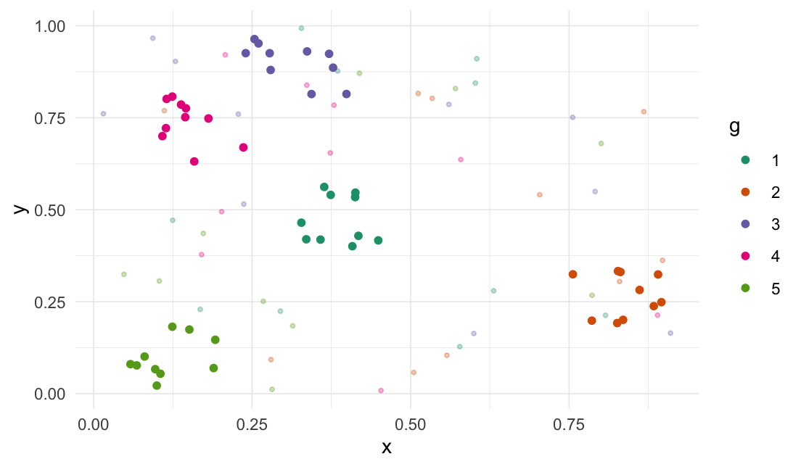
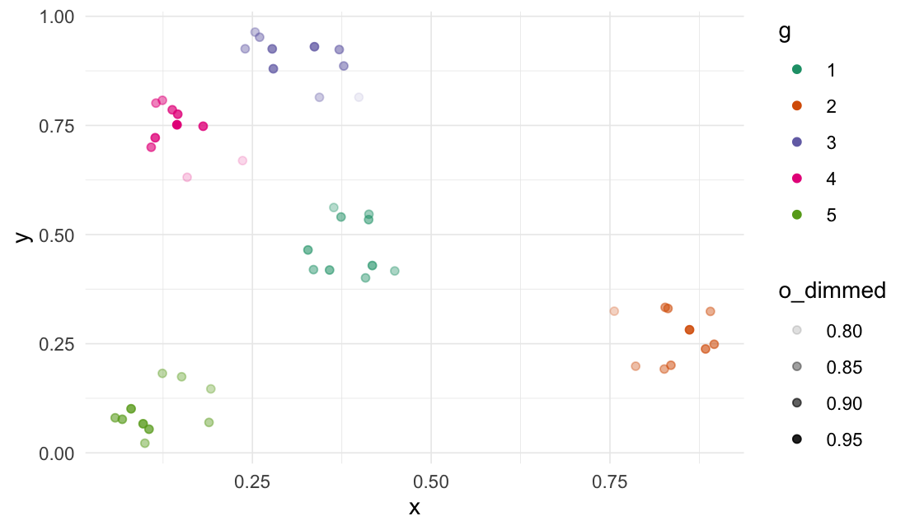
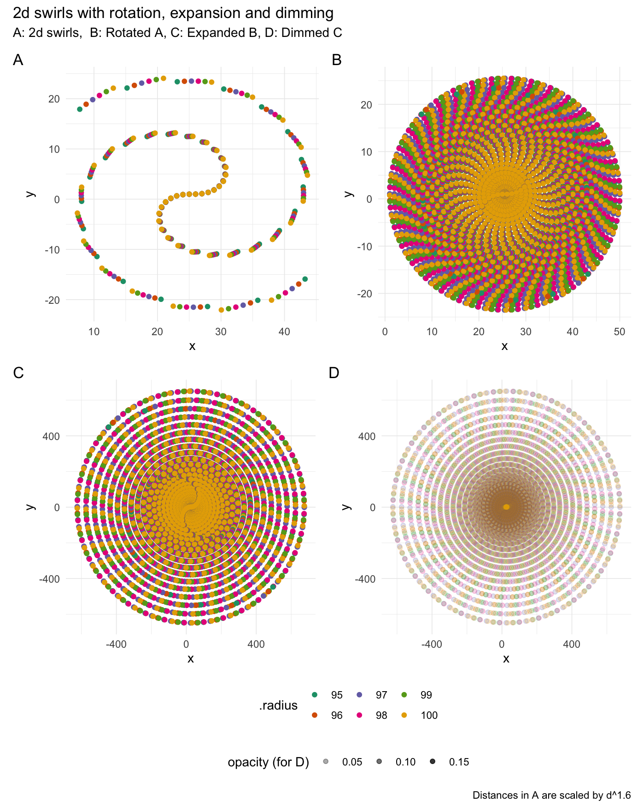
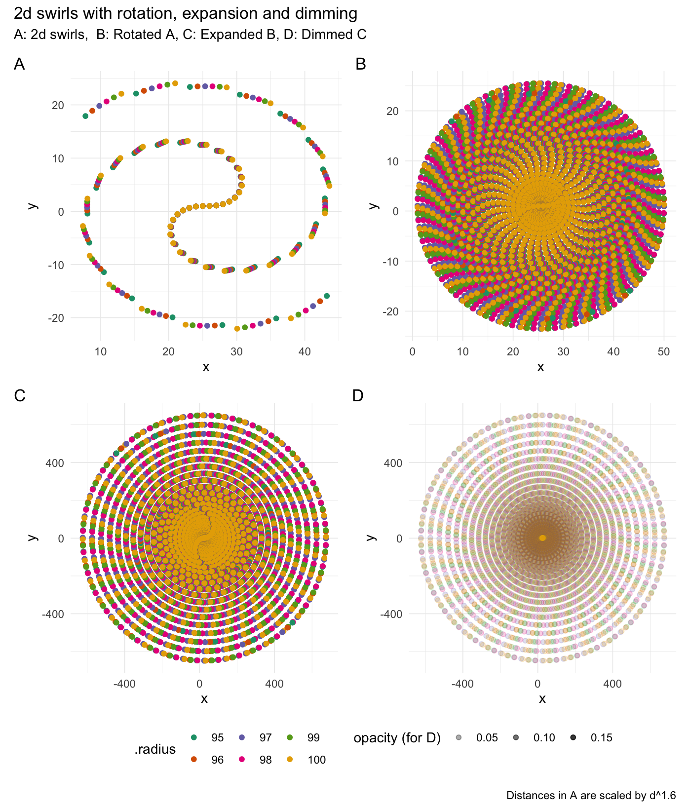

<!-- README.md is generated from README.Rmd. Please edit that file -->

<!-- # rearrr <a href='https://github.com/LudvigOlsen/rearrr'></a> -->

# rearrr

**Rearrrange Data**  
**Authors:** [Ludvig R. Olsen](http://ludvigolsen.dk/) (
<r-pkgs@ludvigolsen.dk> ) <br/> **License:**
[MIT](https://opensource.org/licenses/MIT) <br/> **Started:** April
2020

[](https://cran.r-project.org/package=rearrr)
[](https://cran.r-project.org/package=rearrr)
[](https://cran.r-project.org/)
[](https://codecov.io/gh/ludvigolsen/rearrr?branch=master)
[](https://travis-ci.org/LudvigOlsen/rearrr)
[](https://ci.appveyor.com/project/LudvigOlsen/rearrr)
<!-- [](https://zenodo.org/badge/latestdoi/71063931) -->

## Overview

R package for rearranging data by a set of methods.

We distinguish between **rearrangers** and **mutators**, where the first
*reorders* the data points and the second *changes the values* of the
data
points.

### Rearrangers

| Function          | Description                                                            |
| :---------------- | :--------------------------------------------------------------------- |
| `center_max()`    | Center the highest value with values decreasing around it.             |
| `center_min()`    | Center the lowest value with values increasing around it.              |
| `position_max()`  | Position the highest value with values decreasing around it.           |
| `position_min()`  | Position the lowest value with values increasing around it.            |
| `pair_extremes()` | Arrange values as highest, lowest, second highest, second lowest, etc. |
| `closest_to()`    | Order values by shortest distance to a target.                         |
| `furthest_from()` | Order values by longest distance to a target.                          |
| `rev_windows()`   | Reverse order window-wise.                                             |

### Mutators

| Function                  | Description                                                           | Dimensions   |
| :------------------------ | :-------------------------------------------------------------------- | :----------- |
| `flip_values()`           | Flip the values around an origin.                                     | n            |
| `expand_distances()`      | Expand distances to an origin.                                        | n            |
| `expand_distances_each()` | Expand distances to an origin separately for each dimension.          | n            |
| `cluster_groups()`        | Move data points into clusters around group centroids.                | n            |
| `dim_values()`            | Dim values of a dimension by the distance to an n-dimensional origin. | n (alters 1) |
| `rotate_2d()`             | Rotate values around an origin in 2 dimensions.                       | 2            |
| `rotate_3d()`             | Rotate values around an origin in 3 dimensions.                       | 3            |
| `swirl_2d()`              | Swirl values around an origin in 2 dimensions.                        | 2            |
| `swirl_3d()`              | Swirl values around an origin in 3 dimensions.                        | 3            |

### Generators

| Function              | Description                      |
| :-------------------- | :------------------------------- |
| `generate_clusters()` | Generate n-dimensional clusters. |

### Helpers

| Function               | Description                                                          |
| :--------------------- | :------------------------------------------------------------------- |
| `create_dimming_fn()`  | Creates function for controlling dimming values with `dim_values()`. |
| `create_origin_fn()`   | Creates function for finding origin coordinates (like `centroid()`). |
| `centroid()`           | Calculates the mean of each supplied vector.                         |
| `most_centered()`      | Finds coordinates of data point closest to the centroid.             |
| `transfer_centroids()` | Transfer centroids from one `data.frame` to another.                 |
| `min_max_scale()`      | Scale values to a range.                                             |

## Table of Contents

  - [rearrr](#rearrr)
      - [Overview](#overview)
          - [Rearrangers](#rearrangers)
          - [Mutators](#mutators)
          - [Generators](#generators)
          - [Helpers](#helpers)
      - [Installation](#installation)
      - [Attach packages](#attach-packages)
      - [Rearranger examples](#rearranger-examples)
          - [Center min/max](#center-min/max)
          - [Position min/max](#position-min/max)
          - [Pair extremes](#pair-extremes)
          - [Closest to / furthest from](#closest-to-/-furthest-from)
          - [Reverse windows](#reverse-windows)
      - [Mutator examples](#mutator-examples)
          - [Flip values](#flip-values)
          - [Expand distances](#expand-distances)
          - [Cluster groups](#cluster-groups)
          - [Dim values](#dim-values)
          - [Rotate values](#rotate-values)
          - [Swirl values](#swirl-values)
      - [Generators](#generators)
          - [Generate clusters](#generate-clusters)

## Installation

<!-- CRAN: -->

<!-- > `install.packages("rearrr")` -->

Development
version:

> `install.packages("devtools")`
> 
> `devtools::install_github("LudvigOlsen/rearrr")`

<!-- ## Vignettes   -->

<!-- `rearrr` contains a number of vignettes with relevant use cases and descriptions:   -->

<!-- > `vignette(package = "rearrr")` # for an overview    -->

## Attach packages

Let’s see some **examples**. We start by attaching the necessary
packages:

``` r
library(rearrr)
library(knitr)        # kable()
library(dplyr)        # %>% arrange()
library(tidyr)        # gather()
library(ggplot2)
library(patchwork)

xpectr::set_test_seed(1)
```

<!-- Note: The `kable()` function simply **formats** the output and is not required. -->

While we can use the functions with data frames, we showcase many of
them with a vector for simplicity. The functions work with grouped data
frames and in `magrittr` pipelines (`%>%`).

## Rearranger examples

Rearrangers change the order of the data points.

### Center min/max

``` r
center_max(data = 1:10)
#>  [1]  1  3  5  7  9 10  8  6  4  2
```

``` r
center_min(data = 1:10)
#>  [1] 10  8  6  4  2  1  3  5  7  9
```


### Position min/max

``` r
position_max(data = 1:10, position = 3)
#>  [1]  6  8 10  9  7  5  4  3  2  1
```

``` r
position_min(data = 1:10, position = 3)
#>  [1]  5  3  1  2  4  6  7  8  9 10
```


### Pair extremes

``` r
pair_extremes(data = 1:10, keep_factor = TRUE)
#> # A tibble: 10 x 2
#>    Value .pair
#>    <int> <fct>
#>  1     1 1    
#>  2    10 1    
#>  3     2 2    
#>  4     9 2    
#>  5     3 3    
#>  6     8 3    
#>  7     4 4    
#>  8     7 4    
#>  9     5 5    
#> 10     6 5
```


### Closest to / furthest from

The target value/index can be passed as either a specific value or a
function.

``` r
closest_to(data = 1:10, target_fn = median)
#>  [1]  5  6  4  7  3  8  2  9  1 10
```

``` r
furthest_from(data = 1:10, target = 5)
#>  [1] 10  1  9  2  8  3  7  4  6  5
```


### Reverse windows

``` r
rev_windows(data = 1:10, window_size = 3)
#>  [1]  3  2  1  6  5  4  9  8  7 10
```


## Mutator examples

Mutators change the values of the data points.

### Flip values

``` r
# Set seed for reproducibility
xpectr::set_test_seed(1)

# Draw random numbers 
random_sample <- round(runif(10), digits=4)
random_sample
#>  [1] 0.2655 0.3721 0.5729 0.9082 0.2017 0.8984 0.9447 0.6608 0.6291 0.0618

# The median value to flip around
median(random_sample)
#> [1] 0.601

# Flip the random numbers around the median
flip_values(data = random_sample, origin_fn = create_origin_fn(median))
#> # A tibble: 10 x 3
#>     Value Value_flipped .origin  
#>     <dbl>         <dbl> <list>   
#>  1 0.266          0.936 <dbl [1]>
#>  2 0.372          0.830 <dbl [1]>
#>  3 0.573          0.629 <dbl [1]>
#>  4 0.908          0.294 <dbl [1]>
#>  5 0.202          1.00  <dbl [1]>
#>  6 0.898          0.304 <dbl [1]>
#>  7 0.945          0.257 <dbl [1]>
#>  8 0.661          0.541 <dbl [1]>
#>  9 0.629          0.573 <dbl [1]>
#> 10 0.0618         1.14  <dbl [1]>
```


### Expand distances

``` r
# 1d expansion
expand_distances(
  random_sample,
  multiplier = 3,
  origin_fn = centroid,
  exponentiate = TRUE
)
#> # A tibble: 10 x 4
#>     Value Value_expanded .exponent .origin  
#>     <dbl>          <dbl>     <dbl> <list>   
#>  1 0.266         -0.575          3 <dbl [1]>
#>  2 0.372         -0.0891         3 <dbl [1]>
#>  3 0.573          0.617          3 <dbl [1]>
#>  4 0.908          2.05           3 <dbl [1]>
#>  5 0.202         -0.908          3 <dbl [1]>
#>  6 0.898          1.99           3 <dbl [1]>
#>  7 0.945          2.26           3 <dbl [1]>
#>  8 0.661          0.916          3 <dbl [1]>
#>  9 0.629          0.803          3 <dbl [1]>
#> 10 0.0618        -1.75           3 <dbl [1]>
```

2d
expansion:


### Cluster groups

``` r
# Set seed for reproducibility
xpectr::set_test_seed(3)

# Create data frame with random data and a grouping variable
df <- data.frame(
  "x" = runif(50),
  "y" = runif(50),
  "g" = rep(c(1, 2, 3, 4, 5), each = 10)
) 


cluster_groups(df, cols = c("x", "y"), group_col = "g")
#> # A tibble: 50 x 5
#>        x     y x_clustered y_clustered     g
#>    <dbl> <dbl>       <dbl>       <dbl> <dbl>
#>  1 0.168 0.229       0.335       0.420     1
#>  2 0.808 0.213       0.449       0.417     1
#>  3 0.385 0.877       0.374       0.540     1
#>  4 0.328 0.993       0.364       0.562     1
#>  5 0.602 0.844       0.413       0.534     1
#>  6 0.604 0.910       0.413       0.547     1
#>  7 0.125 0.471       0.328       0.465     1
#>  8 0.295 0.224       0.358       0.419     1
#>  9 0.578 0.128       0.408       0.401     1
#> 10 0.631 0.280       0.418       0.429     1
#> # … with 40 more rows
```


### Dim values

``` r
# Add a column with 1s
df_clustered$o <- 1

# Dim the "o" column (uses last column in `cols` by default)
# based on the data point's distance to the most central point in the cluster
df_clustered %>% 
  dplyr::group_by(g) %>% 
  dim_values(cols = c("x_clustered", "y_clustered", "o"), origin_fn = most_centered)
#> # A tibble: 50 x 6
#>    x_clustered y_clustered     g     o o_dimmed .origin  
#>          <dbl>       <dbl> <dbl> <dbl>    <dbl> <list>   
#>  1       0.335       0.420     1     1    0.853 <dbl [3]>
#>  2       0.449       0.417     1     1    0.936 <dbl [3]>
#>  3       0.374       0.540     1     1    0.798 <dbl [3]>
#>  4       0.364       0.562     1     1    0.765 <dbl [3]>
#>  5       0.413       0.534     1     1    0.819 <dbl [3]>
#>  6       0.413       0.547     1     1    0.801 <dbl [3]>
#>  7       0.328       0.465     1     1    0.831 <dbl [3]>
#>  8       0.358       0.419     1     1    0.889 <dbl [3]>
#>  9       0.408       0.401     1     1    0.943 <dbl [3]>
#> 10       0.418       0.429     1     1    1     <dbl [3]>
#> # … with 40 more rows
```


### Rotate values

2-dimensional rotation:

``` r
rotate_2d(random_sample, degrees = 60, origin_fn = centroid)
#> # A tibble: 10 x 6
#>    Index  Value Index_rotated Value_rotated .origin   .degrees
#>    <int>  <dbl>         <dbl>         <dbl> <list>       <dbl>
#>  1     1 0.266           3.50       -3.49   <dbl [2]>       60
#>  2     2 0.372           3.91       -2.57   <dbl [2]>       60
#>  3     3 0.573           4.23       -1.60   <dbl [2]>       60
#>  4     4 0.908           4.44       -0.569  <dbl [2]>       60
#>  5     5 0.202           5.55       -0.0564 <dbl [2]>       60
#>  6     6 0.898           5.45        1.16   <dbl [2]>       60
#>  7     7 0.945           5.91        2.05   <dbl [2]>       60
#>  8     8 0.661           6.66        2.77   <dbl [2]>       60
#>  9     9 0.629           7.18        3.62   <dbl [2]>       60
#> 10    10 0.0618          8.17        4.20   <dbl [2]>       60
```



3-dimensional rotation:

``` r
# Set seed
set.seed(3)

# Create a data frame
df <- data.frame(
  "x" = 1:12,
  "y" = c(1, 2, 3, 4, 9, 10, 11,
          12, 15, 16, 17, 18),
  "z" = runif(12),
  "g" = rep(1:3, each=4)
)

# Perform rotation
rotate_3d(df, x_col = "x", y_col = "y", z_col = "z", 
         x_deg = 45, y_deg = 90, z_deg = 135, 
         origin_fn = centroid)
#> # A tibble: 12 x 10
#>        x     y     z     g x_rotated y_rotated z_rotated .origin .degrees
#>    <int> <dbl> <dbl> <int>     <dbl>     <dbl>     <dbl> <list>  <list>  
#>  1     1     1 0.168     1    15.3        9.54    5.96   <dbl [… <dbl [3…
#>  2     2     2 0.808     1    14.3       10.2     4.96   <dbl [… <dbl [3…
#>  3     3     3 0.385     1    13.3        9.76    3.96   <dbl [… <dbl [3…
#>  4     4     4 0.328     1    12.3        9.70    2.96   <dbl [… <dbl [3…
#>  5     5     9 0.602     2     7.33       9.97    1.96   <dbl [… <dbl [3…
#>  6     6    10 0.604     2     6.33       9.98    0.962  <dbl [… <dbl [3…
#>  7     7    11 0.125     2     5.33       9.50   -0.0384 <dbl [… <dbl [3…
#>  8     8    12 0.295     2     4.33       9.67   -1.04   <dbl [… <dbl [3…
#>  9     9    15 0.578     3     1.33       9.95   -2.04   <dbl [… <dbl [3…
#> 10    10    16 0.631     3     0.333     10.0    -3.04   <dbl [… <dbl [3…
#> 11    11    17 0.512     3    -0.667      9.88   -4.04   <dbl [… <dbl [3…
#> 12    12    18 0.505     3    -1.67       9.88   -5.04   <dbl [… <dbl [3…
#> # … with 1 more variable: .degrees_str <chr>
```



### Swirl values

2-dimensional swirling:

``` r
# Rotate values
swirl_2d(rep(1, 50), radius = 95)
#> # A tibble: 50 x 7
#>    Index Value Index_swirled Value_swirled .origin   .degrees .radius
#>    <int> <dbl>         <dbl>         <dbl> <list>       <dbl>   <dbl>
#>  1     1     1         0.952          1.05 <dbl [2]>     2.68      95
#>  2     2     1         1.92           1.15 <dbl [2]>     4.24      95
#>  3     3     1         2.88           1.31 <dbl [2]>     5.99      95
#>  4     4     1         3.83           1.53 <dbl [2]>     7.81      95
#>  5     5     1         4.76           1.82 <dbl [2]>     9.66      95
#>  6     6     1         5.68           2.18 <dbl [2]>    11.5       95
#>  7     7     1         6.58           2.59 <dbl [2]>    13.4       95
#>  8     8     1         7.45           3.07 <dbl [2]>    15.3       95
#>  9     9     1         8.30           3.61 <dbl [2]>    17.2       95
#> 10    10     1         9.13           4.21 <dbl [2]>    19.0       95
#> # … with 40 more rows
```



3-dimensional swirling:

``` r
# Set seed
set.seed(4)

# Create a data frame
df <- data.frame(
  "x" = 1:50,
  "y" = 1:50,
  "z" = 1:50,
  "r1" = runif(50),
  "r2" = runif(50) * 35,
  "o" = 1,
  "g" = rep(1:5, each=10)
)

# They see me swiiirling
swirl_3d(df, x_radius = 45, x_col = "x", y_col = "y", z_col ="z", keep_original = FALSE)
#> # A tibble: 50 x 7
#>    x_swirled y_swirled z_swirled .origin   .degrees  .radius   .radius_str 
#>        <dbl>     <dbl>     <dbl> <list>    <list>    <list>    <chr>       
#>  1         1     0.872      1.11 <dbl [3]> <dbl [3]> <dbl [3]> x=45,y=0,z=0
#>  2         2     1.46       2.42 <dbl [3]> <dbl [3]> <dbl [3]> x=45,y=0,z=0
#>  3         3     1.74       3.87 <dbl [3]> <dbl [3]> <dbl [3]> x=45,y=0,z=0
#>  4         4     1.68       5.40 <dbl [3]> <dbl [3]> <dbl [3]> x=45,y=0,z=0
#>  5         5     1.27       6.96 <dbl [3]> <dbl [3]> <dbl [3]> x=45,y=0,z=0
#>  6         6     0.508      8.47 <dbl [3]> <dbl [3]> <dbl [3]> x=45,y=0,z=0
#>  7         7    -0.604      9.88 <dbl [3]> <dbl [3]> <dbl [3]> x=45,y=0,z=0
#>  8         8    -2.05      11.1  <dbl [3]> <dbl [3]> <dbl [3]> x=45,y=0,z=0
#>  9         9    -3.80      12.1  <dbl [3]> <dbl [3]> <dbl [3]> x=45,y=0,z=0
#> 10        10    -5.82      12.9  <dbl [3]> <dbl [3]> <dbl [3]> x=45,y=0,z=0
#> # … with 40 more rows
```



## Generators

### Generate clusters

``` r
generate_clusters(num_rows = 50, num_cols = 5, num_clusters = 5, compactness = 1.6)
#> # A tibble: 50 x 6
#>       D1    D2    D3     D4    D5 .cluster
#>    <dbl> <dbl> <dbl>  <dbl> <dbl> <fct>   
#>  1 0.316 0.553 0.523 0.202  0.653 1       
#>  2 0.279 0.753 0.447 0.0774 0.788 1       
#>  3 0.301 0.516 0.530 0.0541 0.842 1       
#>  4 0.350 0.594 0.540 0.0701 0.922 1       
#>  5 0.239 0.497 0.677 0.102  0.621 1       
#>  6 0.264 0.632 0.670 0.0742 0.845 1       
#>  7 0.273 0.589 0.696 0.0681 0.885 1       
#>  8 0.273 0.592 0.559 0.0944 0.987 1       
#>  9 0.336 0.569 0.618 0.212  0.670 1       
#> 10 0.302 0.605 0.545 0.0601 0.938 1       
#> # … with 40 more rows
```


