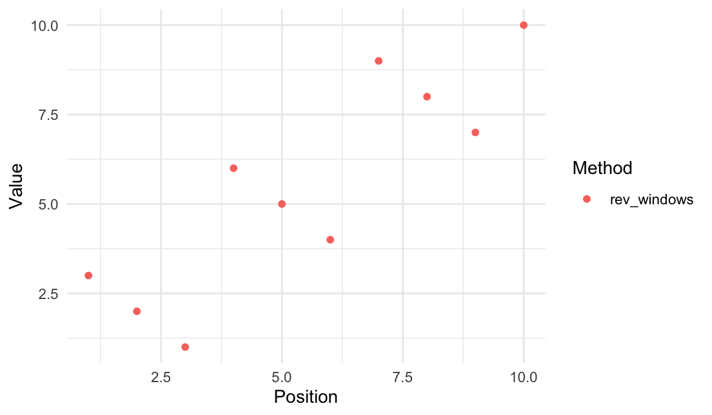

<!-- README.md is generated from README.Rmd. Please edit that file -->

<!-- # rearrr <a href='https://github.com/LudvigOlsen/rearrr'></a> -->

# rearrr

**Rearrrange Data**  
**Authors:** [Ludvig R. Olsen](http://ludvigolsen.dk/) (
<r-pkgs@ludvigolsen.dk> ) <br/> **License:**
[MIT](https://opensource.org/licenses/MIT) <br/> **Started:** April
2020

[](https://cran.r-project.org/package=rearrr)
[](https://cran.r-project.org/package=rearrr)
[](https://cran.r-project.org/)
[](https://codecov.io/gh/ludvigolsen/rearrr?branch=master)
[](https://travis-ci.org/LudvigOlsen/rearrr)
[](https://ci.appveyor.com/project/LudvigOlsen/rearrr)
<!-- [](https://zenodo.org/badge/latestdoi/71063931) -->

## Overview

R package for rearranging data by a set of
methods.

### Main functions

| Function          | Description                                                            |
| :---------------- | :--------------------------------------------------------------------- |
| `center_max()`    | Center the highest value with values decreasing around it.             |
| `center_min()`    | Center the lowest value with values increasing around it.              |
| `position_max()`  | Position the highest value with values decreasing around it.           |
| `position_min()`  | Position the lowest value with values increasing around it.            |
| `pair_extremes()` | Arrange values as highest, lowest, second highest, second lowest, etc. |
| `rev_windows()`   | Reverse order window-wise.                                             |

## Table of Contents

  - [rearrr](#rearrr)
      - [Overview](#overview)
          - [Main functions](#main-functions)
      - [Installation](#installation)
  - [Examples](#examples)
      - [Attach packages](#attach-packages)
      - [Center min/max](#center-min/max)
      - [Position min/max](#position-min/max)
      - [Pair extremes](#pair-extremes)
      - [Reverse windows](#reverse-windows)

## Installation

<!-- CRAN: -->

<!-- > `install.packages("rearrr")` -->

Development
version:

> `install.packages("devtools")`
> 
> `devtools::install_github("LudvigOlsen/rearrr")`

<!-- ## Vignettes   -->

<!-- `rearrr` contains a number of vignettes with relevant use cases and descriptions:   -->

<!-- > `vignette(package = "rearrr")` # for an overview    -->

# Examples

## Attach packages

``` r
library(rearrr)
library(knitr)        # kable()
library(dplyr)        # %>% arrange()
library(tidyr)        # gather()
library(ggplot2)
```

<!-- Note: The `kable()` function simply **formats** the output and is not required. -->

While we can use the functions with data frames, we showcase them with a
vector for simplicity. The functions work with grouped data frames and
in `magrittr` pipelines (`%>%`).

## Center min/max

``` r
center_max(data = 1:10)
#>  [1]  1  3  5  7  9 10  8  6  4  2
```

``` r
center_min(data = 1:10)
#>  [1] 10  8  6  4  2  1  3  5  7  9
```


## Position min/max

``` r
position_max(data = 1:10, position = 3)
#>  [1]  6  8 10  9  7  5  4  3  2  1
```

``` r
position_min(data = 1:10, position = 3)
#>  [1]  5  3  1  2  4  6  7  8  9 10
```


## Pair extremes

``` r
pair_extremes(data = 1:10, keep_factor = TRUE)
#>    Value .pair
#> 1      1     1
#> 2     10     1
#> 3      2     2
#> 4      9     2
#> 5      3     3
#> 6      8     3
#> 7      4     4
#> 8      7     4
#> 9      5     5
#> 10     6     5
```


## Reverse windows

``` r
rev_windows(data = 1:10, window_size = 3)
#>  [1]  3  2  1  6  5  4  9  8  7 10
```


