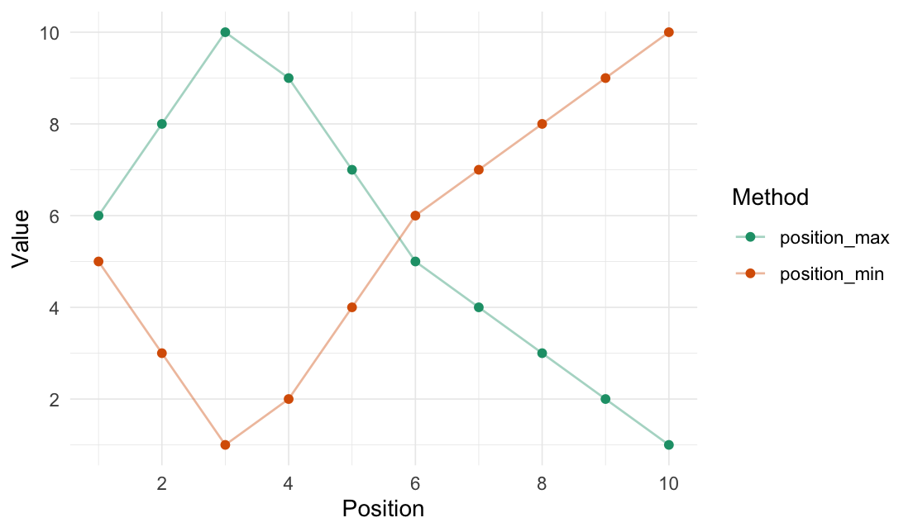

<!-- README.md is generated from README.Rmd. Please edit that file -->
<!-- # rearrr <a href='https://github.com/LudvigOlsen/rearrr'></a> -->

# rearrr

**Rearrrange Data**  
**Authors:** [Ludvig R. Olsen](http://ludvigolsen.dk/) (
<r-pkgs@ludvigolsen.dk> )
<a href='https://twitter.com/ludvigolsen'></a><br/>
**License:** [MIT](https://opensource.org/licenses/MIT) <br/>
**Started:** April 2020

[](https://cran.r-project.org/package=rearrr)
[](https://cran.r-project.org/package=rearrr)
[](https://cran.r-project.org/)
[](https://app.codecov.io/gh/ludvigolsen/rearrr?branch=master)
[](https://ci.appveyor.com/project/LudvigOlsen/rearrr)
[](https://zenodo.org/badge/latestdoi/259158437)

## Overview

R package for rearranging data by a set of methods.

We distinguish between **rearrangers** and **mutators**, where the first
*reorders* the data points and the second *changes the values* of the
data points.

When performing an operation relative to a point in an n-dimensional
vector space, we refer to the point as the **origin**. If we, for
instance, wish to rotate our data points around the point at `x = 3` and
`y = 7`, those are the coordinates of our origin.

</br>

<div style="width: 100%; text-align: center; display: block;">


</div>

<div style="width: 100%; text-align: center; display: block;">


</div>

### Install

CRAN (when available):

> `install.packages("rearrr")`

Development version:

> `install.packages("devtools")`
>
> `devtools::install_github("LudvigOlsen/rearrr")`

<!-- ## Vignettes   -->
<!-- `rearrr` contains a number of vignettes with relevant use cases and descriptions:   -->
<!-- > `vignette(package = "rearrr")` # for an overview    -->

### Rearrangers

| Function              | Description                                                                             |
|:----------------------|:----------------------------------------------------------------------------------------|
| `center_max()`        | Center the highest value with values decreasing around it.                              |
| `center_min()`        | Center the lowest value with values increasing around it.                               |
| `position_max()`      | Position the highest value with values decreasing around it.                            |
| `position_min()`      | Position the lowest value with values increasing around it.                             |
| `pair_extremes()`     | Arrange as lowest, highest, 2nd lowest, 2nd highest, etc.                               |
| `triplet_extremes()`  | Arrange as lowest, most middle, highest, 2nd lowest, 2nd most middle, 2nd highest, etc. |
| `closest_to()`        | Order values by shortest distance to an origin.                                         |
| `furthest_from()`     | Order values by longest distance to an origin.                                          |
| `rev_windows()`       | Reverse order window-wise.                                                              |
| `roll_elements()`     | Rolls/shifts positions of elements.                                                     |
| `shuffle_hierarchy()` | Shuffle multi-column hierarchy of groups.                                               |

### Mutators

| Function                        | Description                                                           | Dimensions   |
|:--------------------------------|:----------------------------------------------------------------------|:-------------|
| `rotate_2d()`, `rotate_3d()`    | Rotate values around an origin in 2 or 3 dimensions.                  | 2 or 3       |
| `swirl_2d()`, `swirl_3d()`      | Swirl values around an origin in 2 or 3 dimensions.                   | 2 or 3       |
| `shear_2d()`, `shear_3d()`      | Shear values around an origin in 2 or 3 dimensions.                   | 2 or 3       |
| `expand_distances()`            | Expand distances to an origin.                                        | n            |
| `expand_distances_each()`       | Expand distances to an origin separately for each dimension.          | n            |
| `cluster_groups()`              | Move data points into clusters around group centroids.                | n            |
| `dim_values()`                  | Dim values of a dimension by the distance to an n-dimensional origin. | n (alters 1) |
| `flip_values()`                 | Flip the values around an origin.                                     | n            |
| `roll_values()`                 | Shifts values and wraps to a range.                                   | n            |
| `wrap_to_range()`               | Wraps values to a range.                                              | n            |
| `transfer_centroids()`          | Transfer centroids from one `data.frame` to another.                  | n            |
| `apply_transformation_matrix()` | Apply transformation `matrix` to `data.frame` columns.                | n            |

### Formers

| Function          | Description                                                     |
|:------------------|:----------------------------------------------------------------|
| `circularize()`   | Create x-coordinates for y-coordinates so they form a circle.   |
| `hexagonalize()`  | Create x-coordinates for y-coordinates so they form a hexagon.  |
| `square()`        | Create x-coordinates for y-coordinates so they form a square.   |
| `triangularize()` | Create x-coordinates for y-coordinates so they form a triangle. |

### Pipelines

| Class                 | Description                                                              |
|:----------------------|:-------------------------------------------------------------------------|
| `Pipeline`            | Chain multiple transformations.                                          |
| `GeneratedPipeline`   | Chain multiple transformations and generate argument values per group.   |
| `FixedGroupsPipeline` | Chain multiple transformations with different argument values per group. |

### Generators

| Function              | Description                      |
|:----------------------|:---------------------------------|
| `generate_clusters()` | Generate n-dimensional clusters. |

Additionally, some functions have `*_vec()` versions, that take and
return a `vector`.

**Note**: The available utility functions (like scalers, converters and
measuring functions) are listed at the bottom of the readme.

## Table of Contents

-   [rearrr](#rearrr)
    -   [Overview](#overview)
        -   [Install](#install)
        -   [Rearrangers](#rearrangers)
        -   [Mutators](#mutators)
        -   [Formers](#formers)
        -   [Pipelines](#pipelines)
        -   [Generators](#generators)
    -   [Attach packages](#attach-packages)
    -   [Rearranger examples](#rearranger-examples)
        -   [Center min/max](#center-min/max)
        -   [Position min/max](#position-min/max)
        -   [Pair extremes](#pair-extremes)
        -   [Closest to / furthest from](#closest-to-/-furthest-from)
        -   [Reverse windows](#reverse-windows)
        -   [Shuffle Hierarchy](#shuffle-hierarchy)
    -   [Mutator examples](#mutator-examples)
        -   [Rotate values](#rotate-values)
        -   [Swirl values](#swirl-values)
        -   [Expand distances](#expand-distances)
        -   [Cluster groups](#cluster-groups)
        -   [Dim values](#dim-values)
        -   [Flip values](#flip-values)
    -   [Forming examples](#forming-examples)
        -   [Circularize points](#circularize-points)
        -   [Hexagonalize points](#hexagonalize-points)
        -   [Square points](#square-points)
        -   [Triangularize points](#triangularize-points)
    -   [Generators](#generators)
        -   [Generate clusters](#generate-clusters)
    -   [Utilities](#utilities)
        -   [Converters](#converters)
        -   [Scalers](#scalers)
        -   [Measuring functions](#measuring-functions)
        -   [Helper functions](#helper-functions)

## Attach packages

Let’s see some **examples**. We start by attaching the necessary
packages:

``` r
library(rearrr)
library(dplyr)

xpectr::set_test_seed(1)
```

<!-- Note: The `kable()` function simply **formats** the output and is not required. -->

While we can use the functions with `data.frames`, we showcase many of
them with a `vector` for simplicity. At times, we use the `*_vec()`
version of a function in order to get the output as a `vector` instead
of a `data.frame`.

The functions work with grouped `data.frames` and in `magrittr`
pipelines (`%>%`).

## Rearranger examples

Rearrangers change the order of the data points.

### Center min/max

``` r
center_max(data = 1:10)
#>  [1]  1  3  5  7  9 10  8  6  4  2
```

``` r
center_min(data = 1:10)
#>  [1] 10  8  6  4  2  1  3  5  7  9
```


### Position min/max

``` r
position_max(data = 1:10, position = 3)
#>  [1]  6  8 10  9  7  5  4  3  2  1
```

``` r
position_min(data = 1:10, position = 3)
#>  [1]  5  3  1  2  4  6  7  8  9 10
```



### Pair extremes

``` r
pair_extremes(data = 1:10)
#> # A tibble: 10 × 2
#>    Value .pair
#>    <int> <fct>
#>  1     1 1    
#>  2    10 1    
#>  3     2 2    
#>  4     9 2    
#>  5     3 3    
#>  6     8 3    
#>  7     4 4    
#>  8     7 4    
#>  9     5 5    
#> 10     6 5
```


### Closest to / furthest from

We use the `_vec()` versions to get the reordered vectors. For
`data.frames`, use `closest_to()`/`furthest_from()` instead.

The origin can be passed as either a specific coordinate (here, a value
in `data`) or a function.

``` r
closest_to_vec(data = 1:10, origin_fn = create_origin_fn(median))
#>  [1]  5  6  4  7  3  8  2  9  1 10
```

``` r
furthest_from_vec(data = 1:10, origin = 5)
#>  [1] 10  1  9  2  8  3  7  4  6  5
```


### Reverse windows

We use the `_vec()` version to get the reordered vector. For
`data.frames`, use `rev_windows()` instead.

``` r
rev_windows_vec(data = 1:10, window_size = 3)
#>  [1]  3  2  1  6  5  4  9  8  7 10
```


### Shuffle Hierarchy

When having a `data.frame` with multiple grouping columns, we can
shuffle them one column (hierarchical level) at a time:

``` r
# Shuffle a given data frame 'df'
shuffle_hierarchy(df, group_cols = c("a", "b", "c"))
```

The columns are shuffled one at a time, as so:

<div style="width: 100%; text-align: center; display: block;">


</div>

## Mutator examples

Mutators change the values of the data points.

### Rotate values

2-dimensional rotation:

``` r
# Set seed for reproducibility
xpectr::set_test_seed(1)

# Draw random numbers 
random_sample <- round(runif(10), digits = 4)
random_sample
#>  [1] 0.2655 0.3721 0.5729 0.9082 0.2017 0.8984 0.9447 0.6608 0.6291 0.0618

rotate_2d(
  data = random_sample,
  degrees = 60,
  origin_fn = centroid
)
#> # A tibble: 10 × 6
#>    Index  Value Index_rotated Value_rotated .origin   .degrees
#>    <int>  <dbl>         <dbl>         <dbl> <list>       <dbl>
#>  1     1 0.266           3.50       -3.49   <dbl [2]>       60
#>  2     2 0.372           3.91       -2.57   <dbl [2]>       60
#>  3     3 0.573           4.23       -1.60   <dbl [2]>       60
#>  4     4 0.908           4.44       -0.569  <dbl [2]>       60
#>  5     5 0.202           5.55       -0.0564 <dbl [2]>       60
#>  6     6 0.898           5.45        1.16   <dbl [2]>       60
#>  7     7 0.945           5.91        2.05   <dbl [2]>       60
#>  8     8 0.661           6.66        2.77   <dbl [2]>       60
#>  9     9 0.629           7.18        3.62   <dbl [2]>       60
#> 10    10 0.0618          8.17        4.20   <dbl [2]>       60
```


3-dimensional rotation:

``` r
# Set seed
set.seed(3)

# Create a data frame
df <- data.frame(
  "x" = 1:12,
  "y" = c(1, 2, 3, 4, 9, 10, 11,
          12, 15, 16, 17, 18),
  "z" = runif(12)
)

# Perform rotation
rotate_3d(
  data = df,
  x_col = "x",
  y_col = "y",
  z_col = "z",
  x_deg = 45,
  y_deg = 90,
  z_deg = 135,
  origin_fn = centroid
)
#> # A tibble: 12 × 9
#>        x     y     z x_rotated y_rotated z_rotated .origin   .degrees  .degree…¹
#>    <int> <dbl> <dbl>     <dbl>     <dbl>     <dbl> <list>    <list>    <chr>    
#>  1     1     1 0.168    15.3        9.54    5.96   <dbl [3]> <dbl [3]> x=45,y=9…
#>  2     2     2 0.808    14.3       10.2     4.96   <dbl [3]> <dbl [3]> x=45,y=9…
#>  3     3     3 0.385    13.3        9.76    3.96   <dbl [3]> <dbl [3]> x=45,y=9…
#>  4     4     4 0.328    12.3        9.70    2.96   <dbl [3]> <dbl [3]> x=45,y=9…
#>  5     5     9 0.602     7.33       9.97    1.96   <dbl [3]> <dbl [3]> x=45,y=9…
#>  6     6    10 0.604     6.33       9.98    0.962  <dbl [3]> <dbl [3]> x=45,y=9…
#>  7     7    11 0.125     5.33       9.50   -0.0384 <dbl [3]> <dbl [3]> x=45,y=9…
#>  8     8    12 0.295     4.33       9.67   -1.04   <dbl [3]> <dbl [3]> x=45,y=9…
#>  9     9    15 0.578     1.33       9.95   -2.04   <dbl [3]> <dbl [3]> x=45,y=9…
#> 10    10    16 0.631     0.333     10.0    -3.04   <dbl [3]> <dbl [3]> x=45,y=9…
#> 11    11    17 0.512    -0.667      9.88   -4.04   <dbl [3]> <dbl [3]> x=45,y=9…
#> 12    12    18 0.505    -1.67       9.88   -5.04   <dbl [3]> <dbl [3]> x=45,y=9…
#> # … with abbreviated variable name ¹​.degrees_str
```


### Swirl values

2-dimensional swirling:

``` r
# Rotate values
swirl_2d(data = rep(1, 50), radius = 95, origin = c(0, 0))
#> # A tibble: 50 × 7
#>    Index Value Index_swirled Value_swirled .origin   .degrees .radius
#>    <int> <dbl>         <dbl>         <dbl> <list>       <dbl>   <dbl>
#>  1     1     1         0.952          1.05 <dbl [2]>     2.68      95
#>  2     2     1         1.92           1.15 <dbl [2]>     4.24      95
#>  3     3     1         2.88           1.31 <dbl [2]>     5.99      95
#>  4     4     1         3.83           1.53 <dbl [2]>     7.81      95
#>  5     5     1         4.76           1.82 <dbl [2]>     9.66      95
#>  6     6     1         5.68           2.18 <dbl [2]>    11.5       95
#>  7     7     1         6.58           2.59 <dbl [2]>    13.4       95
#>  8     8     1         7.45           3.07 <dbl [2]>    15.3       95
#>  9     9     1         8.30           3.61 <dbl [2]>    17.2       95
#> 10    10     1         9.13           4.21 <dbl [2]>    19.0       95
#> # … with 40 more rows
```

<div
style="width: 100%; text-align: center; display: block; padding-top:20px;">


</div>

3-dimensional swirling:

``` r
# Set seed
set.seed(4)

# Create a data frame
df <- data.frame(
  "x" = 1:50,
  "y" = 1:50,
  "z" = 1:50,
  "r1" = runif(50),
  "r2" = runif(50) * 35,
  "o" = 1,
  "g" = rep(1:5, each = 10)
)

# They see me swiiirling
swirl_3d(
  data = df,
  x_radius = 45,
  x_col = "x",
  y_col = "y",
  z_col = "z",
  origin = c(0, 0, 0),
  keep_original = FALSE
)
#> # A tibble: 50 × 7
#>    x_swirled y_swirled z_swirled .origin   .degrees  .radius   .radius_str 
#>        <dbl>     <dbl>     <dbl> <list>    <list>    <list>    <chr>       
#>  1         1     0.872      1.11 <dbl [3]> <dbl [3]> <dbl [3]> x=45,y=0,z=0
#>  2         2     1.46       2.42 <dbl [3]> <dbl [3]> <dbl [3]> x=45,y=0,z=0
#>  3         3     1.74       3.87 <dbl [3]> <dbl [3]> <dbl [3]> x=45,y=0,z=0
#>  4         4     1.68       5.40 <dbl [3]> <dbl [3]> <dbl [3]> x=45,y=0,z=0
#>  5         5     1.27       6.96 <dbl [3]> <dbl [3]> <dbl [3]> x=45,y=0,z=0
#>  6         6     0.508      8.47 <dbl [3]> <dbl [3]> <dbl [3]> x=45,y=0,z=0
#>  7         7    -0.604      9.88 <dbl [3]> <dbl [3]> <dbl [3]> x=45,y=0,z=0
#>  8         8    -2.05      11.1  <dbl [3]> <dbl [3]> <dbl [3]> x=45,y=0,z=0
#>  9         9    -3.80      12.1  <dbl [3]> <dbl [3]> <dbl [3]> x=45,y=0,z=0
#> 10        10    -5.82      12.9  <dbl [3]> <dbl [3]> <dbl [3]> x=45,y=0,z=0
#> # … with 40 more rows
```

<div
style="width: 100%; text-align: center; display: block; padding-top:20px;">


</div>

### Expand distances

``` r
# 1d expansion
expand_distances(
  data = random_sample,
  multiplier = 3,
  origin_fn = centroid,
  exponentiate = TRUE
)
#> # A tibble: 10 × 4
#>     Value Value_expanded .exponent .origin  
#>     <dbl>          <dbl>     <dbl> <list>   
#>  1 0.266         -0.575          3 <dbl [1]>
#>  2 0.372         -0.0891         3 <dbl [1]>
#>  3 0.573          0.617          3 <dbl [1]>
#>  4 0.908          2.05           3 <dbl [1]>
#>  5 0.202         -0.908          3 <dbl [1]>
#>  6 0.898          1.99           3 <dbl [1]>
#>  7 0.945          2.26           3 <dbl [1]>
#>  8 0.661          0.916          3 <dbl [1]>
#>  9 0.629          0.803          3 <dbl [1]>
#> 10 0.0618        -1.75           3 <dbl [1]>
```

2d expansion:


Expand differently in each axis:

``` r
# Expand x-axis and contract y-axis
expand_distances_each(
  data.frame("x" = runif(10),
             "y" = runif(10)),
  cols = c("x", "y"),
  multipliers = c(7, 0.5),
  origin_fn = centroid
)
#> # A tibble: 10 × 7
#>         x      y x_expanded y_expanded .multipliers .multipliers_str .origin  
#>     <dbl>  <dbl>      <dbl>      <dbl> <list>       <chr>            <list>   
#>  1 0.622  0.284      1.37        0.309 <dbl [2]>    x=7,y=0.5        <dbl [2]>
#>  2 0.675  0.610      1.74        0.472 <dbl [2]>    x=7,y=0.5        <dbl [2]>
#>  3 0.802  0.524      2.63        0.428 <dbl [2]>    x=7,y=0.5        <dbl [2]>
#>  4 0.260  0.0517    -1.17        0.192 <dbl [2]>    x=7,y=0.5        <dbl [2]>
#>  5 0.760  0.0757     2.33        0.204 <dbl [2]>    x=7,y=0.5        <dbl [2]>
#>  6 0.0199 0.414     -2.85        0.373 <dbl [2]>    x=7,y=0.5        <dbl [2]>
#>  7 0.955  0.578      3.70        0.455 <dbl [2]>    x=7,y=0.5        <dbl [2]>
#>  8 0.437  0.110      0.0675      0.222 <dbl [2]>    x=7,y=0.5        <dbl [2]>
#>  9 0.0892 0.511     -2.36        0.422 <dbl [2]>    x=7,y=0.5        <dbl [2]>
#> 10 0.361  0.169     -0.466       0.251 <dbl [2]>    x=7,y=0.5        <dbl [2]>
```


### Cluster groups

``` r
# Set seed for reproducibility
xpectr::set_test_seed(3)

# Create data frame with random data and a grouping variable
df <- data.frame(
  "x" = runif(50),
  "y" = runif(50),
  "g" = rep(c(1, 2, 3, 4, 5), each = 10)
) 

cluster_groups(
  data = df, 
  cols = c("x", "y"), 
  group_col = "g"
)
#> # A tibble: 50 × 5
#>        x     y x_clustered y_clustered     g
#>    <dbl> <dbl>       <dbl>       <dbl> <dbl>
#>  1 0.168 0.229       0.335       0.420     1
#>  2 0.808 0.213       0.449       0.417     1
#>  3 0.385 0.877       0.374       0.540     1
#>  4 0.328 0.993       0.364       0.562     1
#>  5 0.602 0.844       0.413       0.534     1
#>  6 0.604 0.910       0.413       0.547     1
#>  7 0.125 0.471       0.328       0.465     1
#>  8 0.295 0.224       0.358       0.419     1
#>  9 0.578 0.128       0.408       0.401     1
#> 10 0.631 0.280       0.418       0.429     1
#> # … with 40 more rows
```


### Dim values

``` r
# Add a column with 1s
df_clustered$o <- 1

# Dim the "o" column based on the data point's distance 
# to the most central point in the cluster
df_clustered %>% 
  dplyr::group_by(g) %>% 
  dim_values(
    cols = c("x_clustered", "y_clustered"), 
    dim_col = "o",
    origin_fn = most_centered
  )
#> # A tibble: 50 × 6
#>    x_clustered y_clustered     g     o o_dimmed .origin  
#>          <dbl>       <dbl> <dbl> <dbl>    <dbl> <list>   
#>  1       0.335       0.420     1     1    0.853 <dbl [2]>
#>  2       0.449       0.417     1     1    0.936 <dbl [2]>
#>  3       0.374       0.540     1     1    0.798 <dbl [2]>
#>  4       0.364       0.562     1     1    0.765 <dbl [2]>
#>  5       0.413       0.534     1     1    0.819 <dbl [2]>
#>  6       0.413       0.547     1     1    0.801 <dbl [2]>
#>  7       0.328       0.465     1     1    0.831 <dbl [2]>
#>  8       0.358       0.419     1     1    0.889 <dbl [2]>
#>  9       0.408       0.401     1     1    0.943 <dbl [2]>
#> 10       0.418       0.429     1     1    1     <dbl [2]>
#> # … with 40 more rows
```


### Flip values

``` r
# The median value to flip around
median(random_sample)
#> [1] 0.601

# Flip the random numbers around the median
flip_values(
  data = random_sample, 
  origin_fn = create_origin_fn(median)
)
#> # A tibble: 10 × 3
#>     Value Value_flipped .origin  
#>     <dbl>         <dbl> <list>   
#>  1 0.266          0.936 <dbl [1]>
#>  2 0.372          0.830 <dbl [1]>
#>  3 0.573          0.629 <dbl [1]>
#>  4 0.908          0.294 <dbl [1]>
#>  5 0.202          1.00  <dbl [1]>
#>  6 0.898          0.304 <dbl [1]>
#>  7 0.945          0.257 <dbl [1]>
#>  8 0.661          0.541 <dbl [1]>
#>  9 0.629          0.573 <dbl [1]>
#> 10 0.0618         1.14  <dbl [1]>
```


## Forming examples

### Circularize points

``` r
circularize(runif(200))
#> # A tibble: 200 × 4
#>     Value .circle_x .degrees .origin  
#>     <dbl>     <dbl>    <dbl> <list>   
#>  1 0.766     -0.418    148.  <dbl [2]>
#>  2 0.682      0.461     21.3 <dbl [2]>
#>  3 0.209     -0.398    216.  <dbl [2]>
#>  4 0.712      0.448     25.1 <dbl [2]>
#>  5 0.605      0.484     12.0 <dbl [2]>
#>  6 0.341      0.467    341.  <dbl [2]>
#>  7 0.0412    -0.178    249.  <dbl [2]>
#>  8 0.402     -0.484    192.  <dbl [2]>
#>  9 0.0791     0.256    301.  <dbl [2]>
#> 10 0.313     -0.457    203.  <dbl [2]>
#> # … with 190 more rows
```

<div
style="width: 100%; text-align: center; display: block; padding-top:20px;">


</div>

### Hexagonalize points

``` r
hexagonalize(runif(200))
#> # A tibble: 200 × 3
#>     Value .hexagon_x .edge
#>     <dbl>      <dbl> <fct>
#>  1 0.0983   -0.0945  4    
#>  2 0.319    -0.413   5    
#>  3 0.996     0.00215 1    
#>  4 0.726    -0.413   5    
#>  5 0.687    -0.413   5    
#>  6 0.629    -0.413   5    
#>  7 0.803     0.335   1    
#>  8 0.543     0.413   2    
#>  9 0.862     0.234   1    
#> 10 0.984    -0.0222  6    
#> # … with 190 more rows
```

<div
style="width: 100%; text-align: center; display: block; padding-top:20px;">


</div>

### Square points

``` r
square(runif(200))
#> # A tibble: 200 × 3
#>    Value .square_x .edge
#>    <dbl>     <dbl> <fct>
#>  1 0.296    0.291  2    
#>  2 0.231    0.225  2    
#>  3 0.914    0.0854 1    
#>  4 0.332    0.327  2    
#>  5 0.556   -0.443  4    
#>  6 0.582   -0.418  4    
#>  7 0.217    0.212  2    
#>  8 0.205    0.200  2    
#>  9 0.970    0.0297 1    
#> 10 0.801   -0.199  4    
#> # … with 190 more rows
```

<div
style="width: 100%; text-align: center; display: block; padding-top:20px;">


</div>

### Triangularize points

``` r
triangularize(runif(200))
#> # A tibble: 200 × 3
#>      Value .triangle_x .edge
#>      <dbl>       <dbl> <fct>
#>  1 0.00823       0     3    
#>  2 0.986         0     3    
#>  3 0.519         0.473 1    
#>  4 0.662         0     3    
#>  5 0.632         0.360 1    
#>  6 0.734         0.258 1    
#>  7 0.668         0     3    
#>  8 0.642         0.350 1    
#>  9 0.584         0.409 1    
#> 10 0.741         0     3    
#> # … with 190 more rows
```

<div
style="width: 100%; text-align: center; display: block; padding-top:20px;">


</div>

## Generators

### Generate clusters

``` r
generate_clusters(
  num_rows = 50,
  num_cols = 5,
  num_clusters = 5,
  compactness = 1.6
)
#> # A tibble: 50 × 6
#>       D1    D2    D3     D4    D5 .cluster
#>    <dbl> <dbl> <dbl>  <dbl> <dbl> <fct>   
#>  1 0.316 0.553 0.523 0.202  0.653 1       
#>  2 0.279 0.753 0.447 0.0774 0.788 1       
#>  3 0.301 0.516 0.530 0.0541 0.842 1       
#>  4 0.350 0.594 0.540 0.0701 0.922 1       
#>  5 0.239 0.497 0.677 0.102  0.621 1       
#>  6 0.264 0.632 0.670 0.0742 0.845 1       
#>  7 0.273 0.589 0.696 0.0681 0.885 1       
#>  8 0.273 0.592 0.559 0.0944 0.987 1       
#>  9 0.336 0.569 0.618 0.212  0.670 1       
#> 10 0.302 0.605 0.545 0.0601 0.938 1       
#> # … with 40 more rows
```


## Utilities

### Converters

| Function               | Description                  |
|:-----------------------|:-----------------------------|
| `radians_to_degrees()` | Converts radians to degrees. |
| `degrees_to_radians()` | Converts degrees to radians. |

### Scalers

| Function           | Description                                               |
|:-------------------|:----------------------------------------------------------|
| `min_max_scale()`  | Scale values to a range.                                  |
| `to_unit_length()` | Scale vectors to unit length *row-wise* or *column-wise*. |

### Measuring functions

| Function          | Description                                                     |
|:------------------|:----------------------------------------------------------------|
| `distance()`      | Calculates distance to an origin.                               |
| `angle()`         | Calculates angle between points and an origin.                  |
| `vector_length()` | Calculates vector length/magnitude *row-wise* or *column-wise*. |

### Helper functions

| Function             | Description                                                          |
|:---------------------|:---------------------------------------------------------------------|
| `create_origin_fn()` | Creates function for finding origin coordinates (like `centroid()`). |
| `centroid()`         | Calculates the mean of each supplied vector/column.                  |
| `most_centered()`    | Finds coordinates of data point closest to the centroid.             |
| `is_most_centered()` | Indicates whether a data point is the most centered.                 |
| `midrange()`         | Calculates the midrange of each supplied vector/column.              |
| `create_n_fn()`      | Creates function for finding the number of positions to move.        |
| `median_index()`     | Calculates median index of each supplied vector.                     |
| `quantile_index()`   | Calculates quantile of indices for each supplied vector.             |
