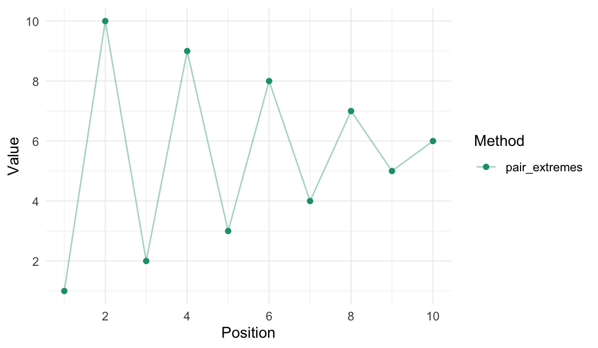

<!-- README.md is generated from README.Rmd. Please edit that file -->

<!-- # rearrr <a href='https://github.com/LudvigOlsen/rearrr'></a> -->

# rearrr

**Rearrrange Data**  
**Authors:** [Ludvig R. Olsen](http://ludvigolsen.dk/) (
<r-pkgs@ludvigolsen.dk> ) <br/> **License:**
[MIT](https://opensource.org/licenses/MIT) <br/> **Started:** April
2020

[](https://cran.r-project.org/package=rearrr)
[](https://cran.r-project.org/package=rearrr)
[](https://cran.r-project.org/)
[](https://codecov.io/gh/ludvigolsen/rearrr?branch=master)
[](https://travis-ci.org/LudvigOlsen/rearrr)
[](https://ci.appveyor.com/project/LudvigOlsen/rearrr)
<!-- [](https://zenodo.org/badge/latestdoi/71063931) -->

## Overview

R package for rearranging data by a set of methods.

  - **Position** the min/max value and have values increase/decrease
    around
it.

### Main functions

| Function          | Description                                                            |
| :---------------- | :--------------------------------------------------------------------- |
| `center_max()`    | Center the highest value with values decreasing around it.             |
| `center_min()`    | Center the lowest value with values increasing around it.              |
| `position_max()`  | Position the highest value with values decreasing around it.           |
| `position_min()`  | Position the lowest value with values increasing around it.            |
| `pair_extremes()` | Arrange values as highest, lowest, second highest, second lowest, etc. |

## Table of Contents

<!-- ```{r toc, echo=FALSE} -->

<!-- rearrr:::render_toc("README.Rmd") -->

<!-- ``` -->

## Installation

<!-- CRAN: -->

<!-- > `install.packages("rearrr")` -->

Development
version:

> `install.packages("devtools")`
> 
> `devtools::install_github("LudvigOlsen/rearrr")`

<!-- ## Vignettes   -->

<!-- `rearrr` contains a number of vignettes with relevant use cases and descriptions:   -->

<!-- > `vignette(package = "rearrr")` # for an overview    -->

# Examples

## Attach packages

``` r
library(rearrr)
library(knitr)        # kable()
library(dplyr)        # %>% arrange()
library(tidyr)        # gather()
library(ggplot2)
```

<!-- Note: The `kable()` function simply **formats** the output and is not required. -->

While we can use the functions with data frames, we showcase them with a
vector for simplicity. The functions work with grouped data frames and
in `magrittr` pipes (`%>%`).

## Center max

``` r
center_max(data = 1:10)$Value
#>  [1]  1  3  5  7  9 10  8  6  4  2
```

## Center min

``` r
center_min(data = 1:10)$Value
#>  [1] 10  8  6  4  2  1  3  5  7  9
```

## Position max

``` r
position_max(data = 1:10, position = 3)$Value
#>  [1]  6  8 10  9  7  5  4  3  2  1
```

## Position min

``` r
position_min(data = 1:10, position = 3)$Value
#>  [1]  5  3  1  2  4  6  7  8  9 10
```

## Pair extremes

``` r
pair_extremes(data = 1:10, keep_factor = TRUE, factor_name = "extreme_pairs")$Value
#>  [1]  1 10  2  9  3  8  4  7  5  6
```

## Visual comparison

``` r
vec <- 1:10
orderings <- data.frame(
  "x" = as.integer(vec),
  "center_max" = center_max(vec)$Value,
  "center_min" = center_min(vec)$Value,
  "position_max" = position_max(vec, position = 3)$Value,
  "position_min" = position_min(vec, position = 3)$Value,
  "pair_extremes" = pair_extremes(vec)$Value
) 

orderings %>% kable()
```

|  x | center\_max | center\_min | position\_max | position\_min | pair\_extremes |
| -: | ----------: | ----------: | ------------: | ------------: | -------------: |
|  1 |           1 |          10 |             6 |             5 |              1 |
|  2 |           3 |           8 |             8 |             3 |             10 |
|  3 |           5 |           6 |            10 |             1 |              2 |
|  4 |           7 |           4 |             9 |             2 |              9 |
|  5 |           9 |           2 |             7 |             4 |              3 |
|  6 |          10 |           1 |             5 |             6 |              8 |
|  7 |           8 |           3 |             4 |             7 |              4 |
|  8 |           6 |           5 |             3 |             8 |              7 |
|  9 |           4 |           7 |             2 |             9 |              5 |
| 10 |           2 |           9 |             1 |            10 |              6 |

``` r
# Convert to long format for plotting
orderings <- orderings %>% 
  tidyr::gather(key = "Method", value = "Value", 2:6) 
```

``` r
# Plot centering methods
orderings %>% 
  dplyr::filter(Method %in% c("center_min", "center_max")) %>% 
  ggplot(aes(x = x, y = Value, color = Method)) + 
  geom_line() + 
  theme_minimal()
```


``` r
# Plot positioning methods
orderings %>% 
  dplyr::filter(Method %in% c("position_min", "position_max")) %>% 
  ggplot(aes(x = x, y = Value, color = Method)) + 
  geom_line() + 
  theme_minimal()
```



``` r
# Plot extreme pairing
orderings %>% 
  dplyr::filter(Method == "pair_extremes") %>% 
  ggplot(aes(x = x, y = Value, color = Method)) + 
  geom_point() + 
  theme_minimal()
```


